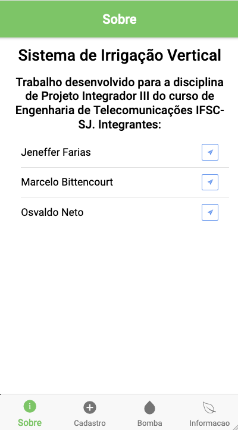
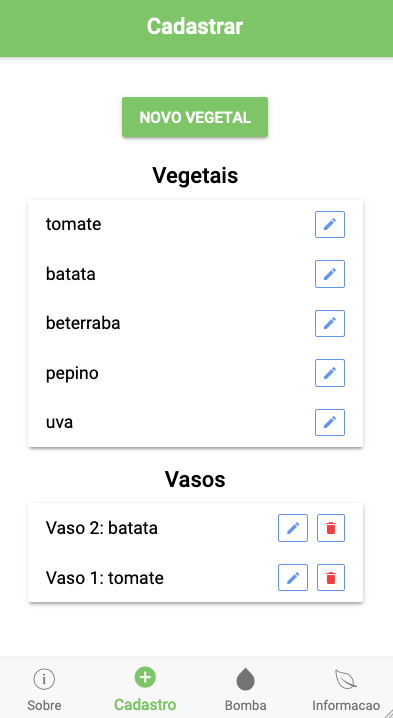
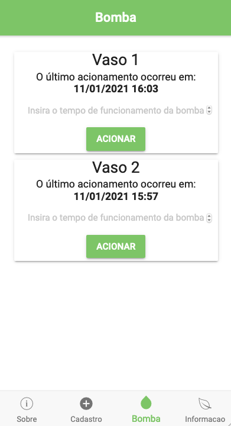
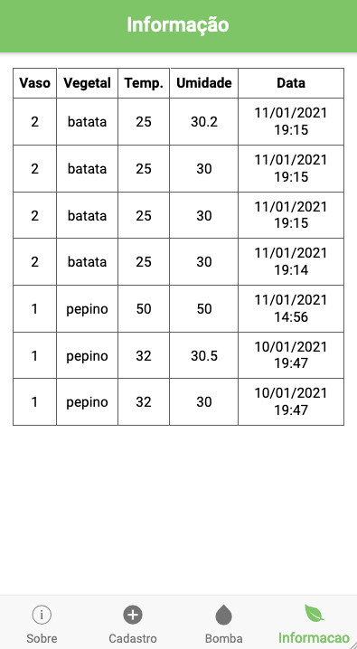

## Sistema de Irrigação Vertical (SIV)
> Aplicativo desenvolvido em IONIC 3 Angular

 

### Abaixo estão demonstradas as principais páginas e ações que o usuário pode realizar no aplicativo.

 

  

     </img>
     </img>
  

  

     </img>
     </img>
  

 

## 1) Página Cadastro

O usuário pode cadatrar um novo vegetal acionando o botão **Novo Vegetal**, que será redirecionado para uma nova página onde deverá informar o nome, a temperatura ideal o a umidade ideal do mesmo. Também será possível alterar as informações de um vegetal já existente acionando o ícone de edição ao lado do vegetal.

Em relação ao vaso, será permitido inativá-lo através do ícone vermelho ao lado de cada um dos objetos, ou alterá-lo para um novo vegetal.

## 2) Página Bomba

Aqui o usuário poderá visualizar quando a bomba de cada vaso foi acionada pela última vez, assim como acioná-la novamente (tempo máximo de 10 segundos).

## 3) Página Informação

Será possível ver todas as informações coletadas pelos sensores do sistema.

